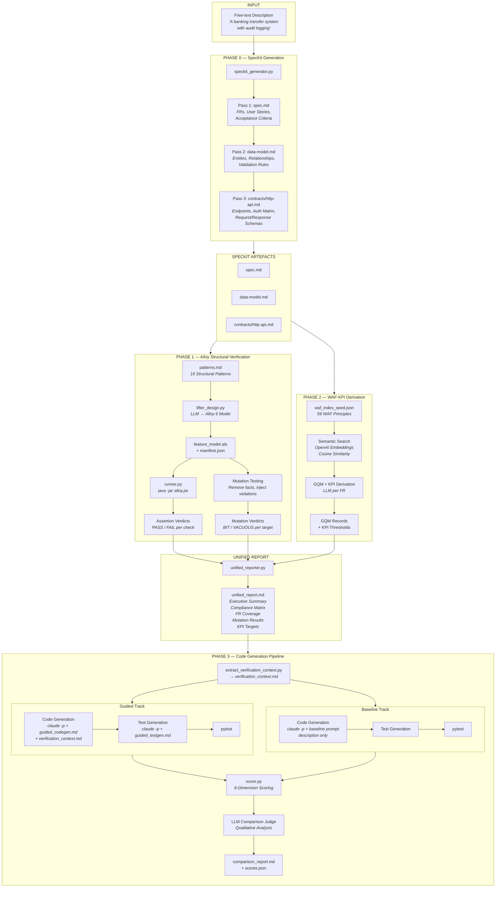
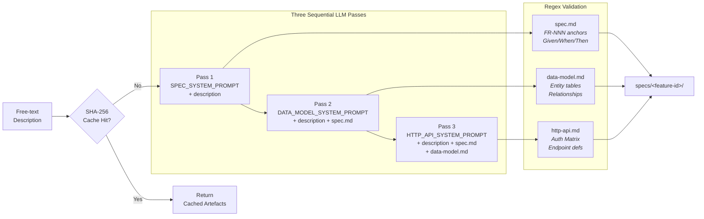
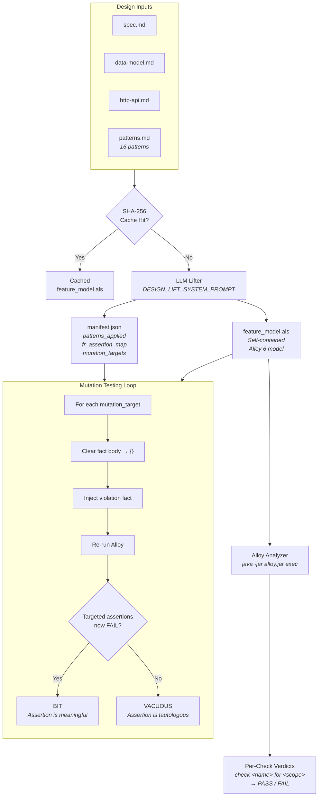
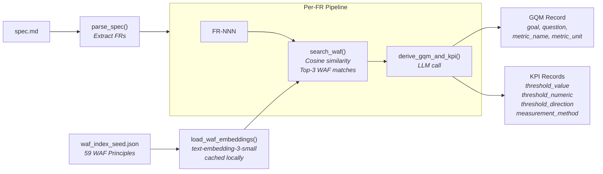
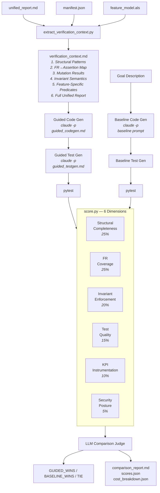
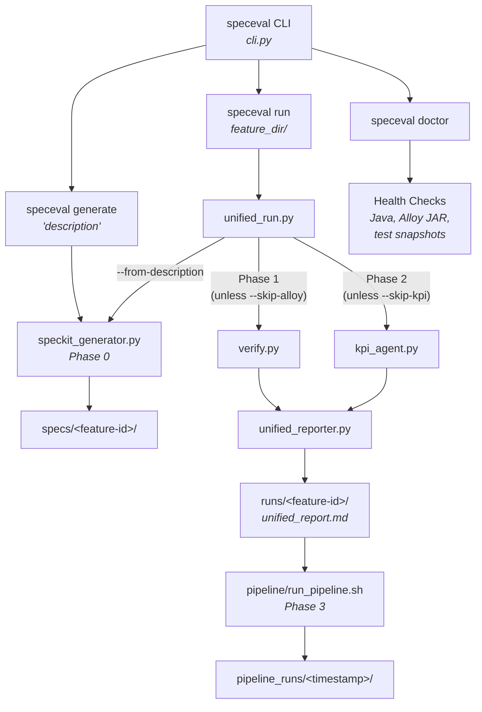
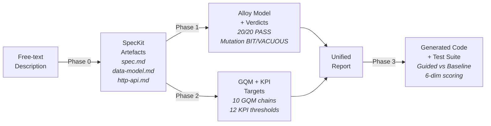
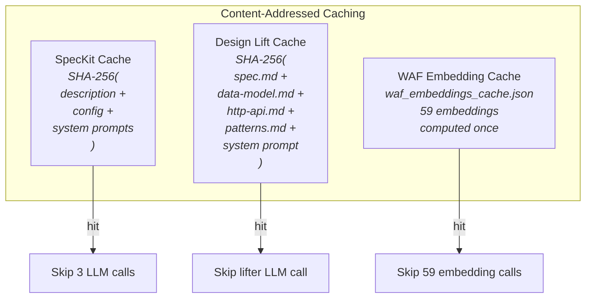

# System Architecture — Specification-Led Development

## High-Level Pipeline

## Component Detail — SpecKit Generator (Phase 0)

## Component Detail — Alloy Verification (Phase 1)

## Component Detail — KPI Derivation (Phase 2)

## Component Detail — Code Generation (Phase 3)

## Orchestration & CLI

## Data Flow Summary

## Caching Strategy

